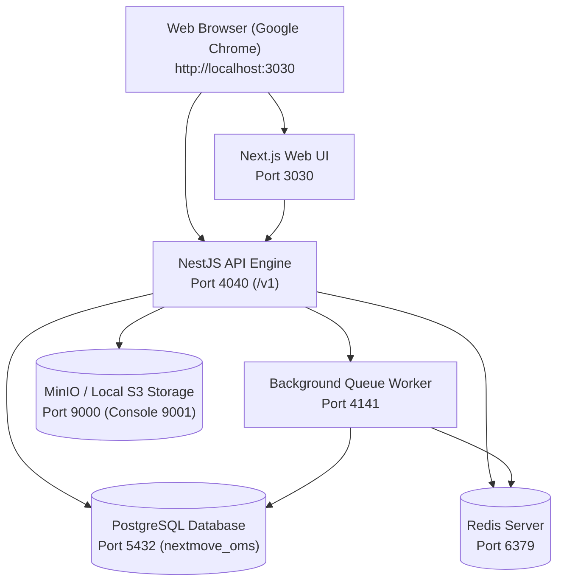
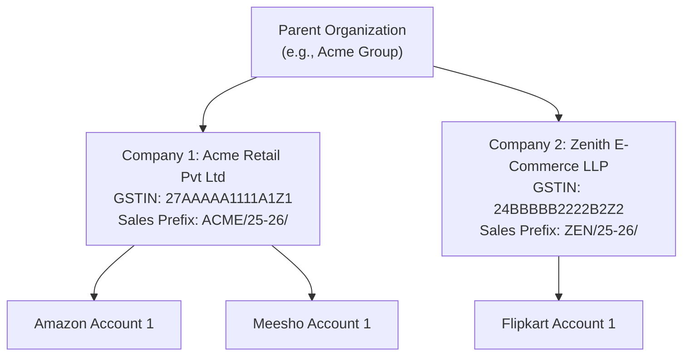
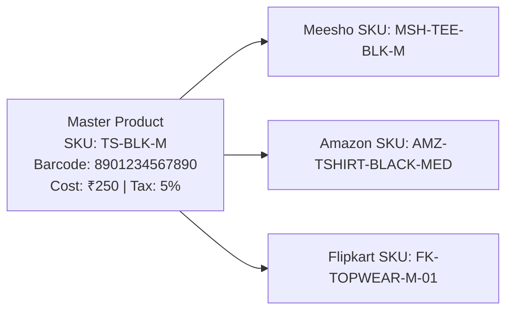
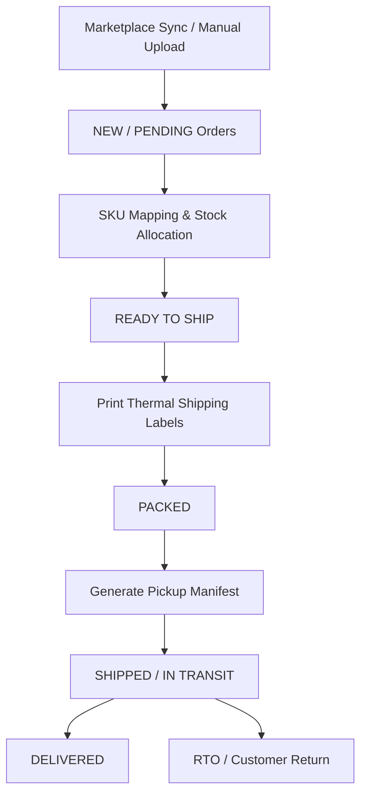
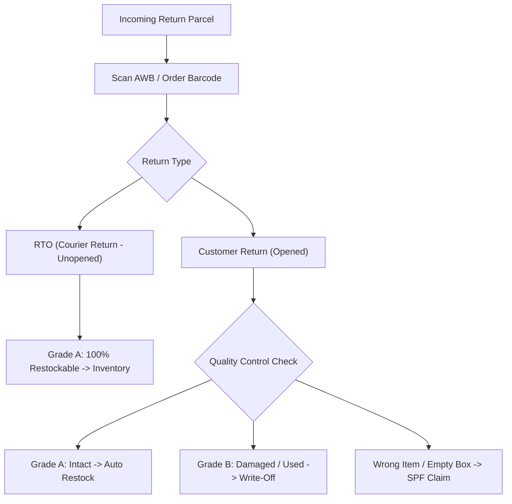
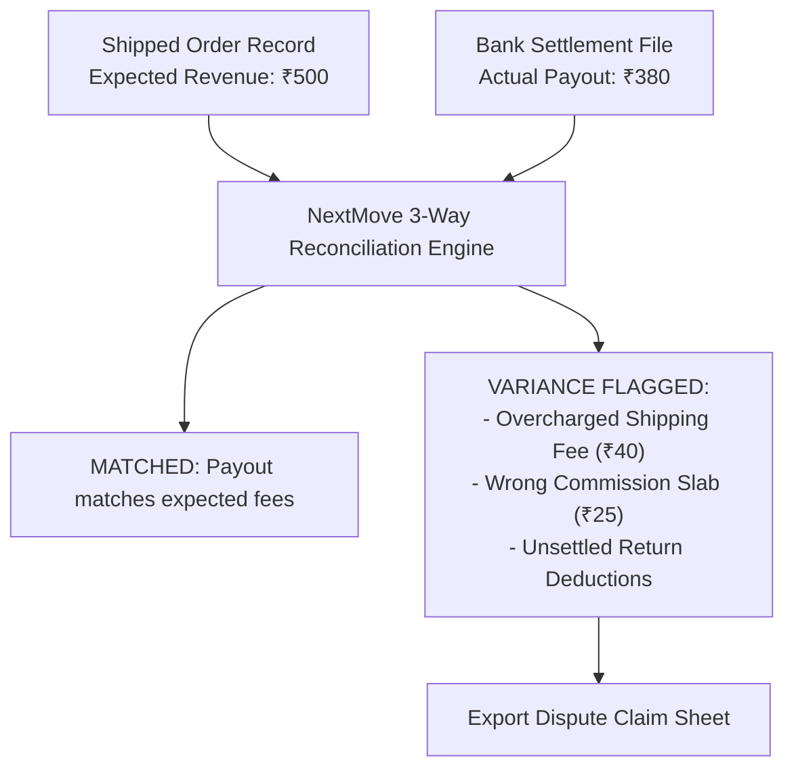
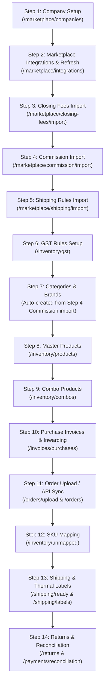

# NextMove OMS — Windows Installer & Complete Client Usage Guide

> **Welcome to NextMove OMS**
> NextMove OMS is a centralized, high-performance Multi-Channel Order Management, Inventory Synchronization, Multi-Warehouse Fulfillment, and Financial Reconciliation platform built specifically for Indian e-commerce sellers across **Meesho**, **Amazon India**, and **Flipkart**.

---

## Table of Contents

1. [System Requirements & Architecture Overview](#1-system-requirements--architecture-overview)
2. [Download & Windows Installer Setup](#2-download--windows-installer-setup)
   - [Fresh Installation](#fresh-installation)
   - [Starting NextMove OMS Services](#starting-nextmove-oms-services)
   - [Accessing the Web Interface](#accessing-the-web-interface)
   - [Stopping or Restarting NextMove OMS](#stopping-or-restarting-nextmove-oms)
3. [First-Time Sign In & Organization Setup](#3-first-time-sign-in--organization-setup)
   - [Creating Your Admin Account & Organization](#creating-your-admin-account--organization)
   - [Logging In & Session Management](#logging-in--session-management)
4. [Company & Legal Entity Setup](#4-company--legal-entity-setup)
   - [Navigating to Company Management](#navigating-to-company-management)
   - [Adding a New Company Profile](#adding-a-new-company-profile)
   - [Configuring Invoice & Note Prefixes](#configuring-invoice--note-prefixes)
5. [Marketplace Integrations & Channel Connections](#5-marketplace-integrations--channel-connections)
   - [Connecting Amazon India](#connecting-amazon-india)
   - [Connecting Meesho Marketplace](#connecting-meesho-marketplace)
   - [Connecting Flipkart Seller Hub](#connecting-flipkart-seller-hub)
   - [Post-Integration Page Refresh & Channel Sub-Menus](#post-integration-page-refresh--channel-sub-menus)
   - [Importing Standard Marketplace Datasets (Closing Fees, Commissions & Shipping)](#importing-standard-marketplace-datasets-closing-fees-commissions--shipping)
   - [Synchronization Policies & Scheduler Settings](#synchronization-policies--scheduler-settings)
   - [Monitoring Sync Health & Execution Logs](#monitoring-sync-health--execution-logs)
6. [Master Catalog & Inventory Configuration](#6-master-catalog--inventory-configuration)
   - [Step 6: Configuring GST Slabs & Tax Rules](#step-6-configuring-gst-slabs--tax-rules)
   - [Step 7: Categories & Brands](#step-7-categories--brands)
   - [Step 8: Creating Master Products](#step-8-creating-master-products)
   - [Step 9: Setting Up Combo & Bundle Products](#step-9-setting-up-combo--bundle-products)
   - [Step 10: Initial Stock Inwarding (Purchase Invoices)](#step-10-initial-stock-inwarding-purchase-invoices)
   - [Step 11: Order Upload & Synchronization (PDF & CSV/XLSX)](#step-11-order-upload--synchronization-pdf--csvxlsx)
   - [Step 12: Marketplace SKU Mapping & Resolving Unmapped SKUs](#step-12-marketplace-sku-mapping--resolving-unmapped-skus)
   - [Real-Time Stock Levels & Warehouse Stock Ledger](#real-time-stock-levels--warehouse-stock-ledger)
7. [Warehouse & Multi-Location Management](#7-warehouse--multi-location-management)
   - [Configuring Warehouses](#configuring-warehouses)
   - [Inter-Warehouse Stock Transfers](#inter-warehouse-stock-transfers)
   - [Stock Adjustments & Write-Offs](#stock-adjustments--write-offs)
   - [Cycle Counting & Physical Audits](#cycle-counting--physical-audits)
8. [Purchases, Inwarding & COGS Tracking](#8-purchases-inwarding--cogs-tracking)
   - [Managing Suppliers / Vendors (Parties)](#managing-suppliers--vendors-parties)
   - [Creating Purchase Invoices & Inwarding Inventory](#creating-purchase-invoices--inwarding-inventory)
   - [Weighted Average COGS (Cost of Goods Sold)](#weighted-average-cogs-cost-of-goods-sold)
9. [Order Processing & Fulfillment Workflow](#9-order-processing--fulfillment-workflow)
   - [Automated API Order Sync](#automated-api-order-sync)
   - [Manual Order & Label Uploads (PDF / CSV / XLSX)](#manual-order--label-uploads-pdf--csv--xlsx)
   - [Managing Orders Across Lifecycle Stages](#managing-orders-across-lifecycle-stages)
   - [Handling Order Exceptions & Address Issues](#handling-order-exceptions--address-issues)
   - [Safe Order Deletion & Stock Restoration](#safe-order-deletion--stock-restoration)
10. [Shipping, Label Generation & Manifests](#10-shipping-label-generation--manifests)
    - [Ready to Ship Queue](#ready-to-ship-queue)
    - [Thermal Shipping Labels (4x6 & A4)](#thermal-shipping-labels-4x6--a4)
    - [Courier Assignment & Pickup Manifests](#courier-assignment--pickup-manifests)
    - [Shipment Tracking & NDR Monitoring](#shipment-tracking--ndr-monitoring)
11. [Returns & Reverse Logistics Management](#11-returns--reverse-logistics-management)
    - [Understanding Customer Returns vs. RTO](#understanding-customer-returns-vs-rto)
    - [Barcode Scan Receiving & Return Grading](#barcode-scan-receiving--return-grading)
    - [Restocking vs. Damaged Write-Off](#restocking-vs-damaged-write-off)
    - [Marketplace SPF Claims & Compensation](#marketplace-spf-claims--compensation)
12. [Sales Invoices, Expenses & GST Reports](#12-sales-invoices-expenses--gst-reports)
    - [Sales Invoices Generation](#sales-invoices-generation)
    - [Operating Expenses Management](#operating-expenses-management)
    - [GST Returns (GSTR-1, GSTR-3B & Tax Summaries)](#gst-returns-gstr-1-gstr-3b--tax-summaries)
13. [Payments, Settlements & Financial Reconciliation](#13-payments-settlements--financial-reconciliation)
    - [Importing Marketplace Settlement Sheets](#importing-marketplace-settlement-sheets)
    - [Automated 3-Way Reconciliation](#automated-3-way-reconciliation)
    - [Marketplace Deductions: Commissions, Closing & Shipping Fees](#marketplace-deductions-commissions-closing--shipping-fees)
    - [COD Remittance & Bank Payout Tracking](#cod-remittance--bank-payout-tracking)
    - [Handling Payment Variances & Problem Orders](#handling-payment-variances--problem-orders)
14. [Reports & Business Analytics](#14-reports--business-analytics)
    - [Order & Sales Performance Reports](#order--sales-performance-reports)
    - [Inventory Valuation & Stock Aging Reports](#inventory-valuation--stock-aging-reports)
    - [Financial P&L & Net Margin Analysis](#financial-pl--net-margin-analysis)
    - [Custom Export Builder](#custom-export-builder)
15. [Backup, Cloud Sync & Disaster Recovery](#15-backup-cloud-sync--disaster-recovery)
    - [Local Database Storage vs Cloud Sync](#local-database-storage-vs-cloud-sync)
    - [Configuring Supabase / Neon Cloud Sync](#configuring-supabase--neon-cloud-sync)
    - [One-Click Cloud Backup & Complete Restore](#one-click-cloud-backup--complete-restore)
16. [Administration, Billing & System Updates](#16-administration-billing--system-updates)
    - [Team Members & Role-Based Permissions](#team-members--role-based-permissions)
    - [Security Audit Logs](#security-audit-logs)
    - [Billing, Subscriptions & Quota Management](#billing-subscriptions--quota-management)
    - [1-Click System Updates](#1-click-system-updates)
17. [Recommended Setup Sequence & Dependencies](#17-recommended-setup-sequence--dependencies)
18. [Troubleshooting & Diagnostic Guide](#18-troubleshooting--diagnostic-guide)

---

## 1. System Requirements & Architecture Overview

NextMove OMS is designed as an ultra-fast, local-first enterprise solution. All critical database records, order caches, inventory engines, and PDF generation workers run directly on your local machine or local server for zero-latency operations, with optional asynchronous cloud backup synchronization.

### Recommended Hardware & Software Specs

| Specification | Minimum Requirement | Recommended Specification |
| :--- | :--- | :--- |
| **Operating System** | Windows 10 (64-bit) / Windows 11 / Windows Server 2019+ | Windows 11 Pro (64-bit) |
| **Processor (CPU)** | Intel Core i3 / AMD Ryzen 3 (4 cores) | Intel Core i5 / AMD Ryzen 5 or higher |
| **Memory (RAM)** | 8 GB RAM | 16 GB RAM or higher |
| **Storage** | 10 GB free disk space (SSD recommended) | 50+ GB SSD (Dedicated Partition or `D:\` drive) |
| **Web Browser** | Google Chrome (Latest) / Microsoft Edge | Google Chrome (Latest) |
| **Display Resolution** | 1366 x 768 | 1920 x 1080 (Full HD) or higher |
| **Internet Connection** | 5 Mbps broadband | 25+ Mbps stable connection for API sync |

### Internal Architecture & Port Allocations

NextMove OMS runs five self-contained engines managed by the Windows launcher:



* **Data Directory:** Defaults automatically to `D:\NextMoveData` if drive `D:\` exists, or `C:\Program Files\NextMove OMS\data` (or your custom install directory `data_path.txt`).
* **Database:** PostgreSQL on `127.0.0.1:5432` (`nextmove_oms` database).
* **Cache & Queues:** Redis server on `127.0.0.1:6379`.
* **File & Media Storage:** S3/MinIO engine on `127.0.0.1:9000`.
* **Backend API:** NestJS core on `http://localhost:4040/v1`.
* **Worker:** Asynchronous queue processing engine on port `4141`.
* **Frontend Web Application:** Next.js UI on `http://localhost:3030`.

---

## 2. Download & Windows Installer Setup

### Fresh Installation

* **Fresh Install:** Download [NextMove OMS v1.97.exe](https://github.com/daksyfashion/nextmove-releases/releases/download/1.97/NextMove.OMS.v1.97.exe)

1. Locate the downloaded file `NextMove.OMS.v1.97.exe` in your Downloads folder.
2. Double-click the installer to launch the NextMove OMS Setup Wizard.
3. If prompted by Windows SmartScreen ("Windows protected your PC"), click **More info** and select **Run anyway**.
4. Choose your destination directory (default is `C:\Program Files\NextMove OMS`).
5. Select whether to create a Desktop Shortcut and Quick Launch icon.
6. Click **Install** and allow the installer to extract all application engines, portable Node runtime, PostgreSQL, Redis, and storage dependencies.
7. Once installation finishes, check **Launch NextMove OMS** and click **Finish**.

> [!TIP]
> If your computer has a dedicated `D:\` drive, NextMove OMS will automatically isolate your operational database and invoice files in `D:\NextMoveData`. This ensures your business data remains completely safe even if Windows is reinstalled on `C:\`.

---

### Starting NextMove OMS Services

You can start NextMove OMS at any time using:
1. The **NextMove OMS** icon on your Desktop.
2. The Start Menu shortcut under `NextMove OMS`.
3. Running `start.bat` inside the installation folder.

When launched, NextMove OMS runs an automated 7-step startup verification in the background:

```text
===================================================
          Starting NextMove OMS Services           
  App Path:  C:\Program Files\NextMove OMS\
  Data Path: D:\NextMoveData
===================================================
[1/7] Initializing local PostgreSQL Database...
[2/7] Starting PostgreSQL Engine (Port 5432)...
[3/7] Starting Redis Engine (Port 6379)...
[4/7] Starting S3 File Storage Engine (Port 9000)...
[5/7] Verifying runtime dependencies...
[6/7] Synchronizing database schema...
[7/7] Launching NextMove OMS API, Worker, and Web UI...
===================================================
NextMove OMS is running in the background!
Web UI:    http://localhost:3030
API:       http://localhost:4040
Data Path: D:\NextMoveData
===================================================
```

---

### Accessing the Web Interface

After the services initialize (takes ~3 to 5 seconds), your default web browser (recommended: **Google Chrome**) will automatically open:

🌐 **Local Application URL:** [`http://localhost:3030`](http://localhost:3030)

> [!NOTE]
> Bookmark `http://localhost:3030` in your browser for instant one-click access. You can also access NextMove OMS from any other computer or barcode scanner terminal on your local office network by opening `http://<HOST-PC-IP>:3030`.

---

### Stopping or Restarting NextMove OMS

To safely stop all database, Redis, S3, API, worker, and web services:
1. Open the installation folder (e.g., `C:\Program Files\NextMove OMS`).
2. Run `stop.bat` as Administrator.
3. The script terminates all active workers and cleanly flushes PostgreSQL database transactions.

---

## 3. First-Time Sign In & Organization Setup

### Creating Your Admin Account & Organization

When opening NextMove OMS for the first time, navigate to the Organization Registration page:

📍 **URL:** [`http://localhost:3030/register`](http://localhost:3030/register)

```
+--------------------------------------------------------------+
|                           [ NM ]                             |
|                  Create your organization                    |
|    Start managing orders across Meesho, Amazon, and Flipkart |
+--------------------------------------------------------------+
| Organization name : [ Acme Retail Pvt Ltd                  ] |
| First name        : [ Arjun         ] Last name: [ Sharma  ] |
| Email address     : [ admin@acmeretail.com                 ] |
| Password          : [ •••••••••••••••                      ] |
|                                                              |
|               [  Create organization  ]                      |
+--------------------------------------------------------------+
```

#### Required Registration Fields:

| Field Name | Description | Example |
| :--- | :--- | :--- |
| **Organization Name** | The overall parent brand, trading business, or enterprise umbrella. | `Acme Retail Pvt Ltd` |
| **First Name** | Administrator first name. | `Arjun` |
| **Last Name** | Administrator last name. | `Sharma` |
| **Email Address** | Primary admin email (used for signing in). | `admin@acmeretail.com` |
| **Password** | Secure password (minimum 8 characters). | `••••••••` |

Click **Create organization**. NextMove OMS creates your tenant environment, provisions security roles with full administrative privileges, and redirects you to the Login screen.

---

### Logging In & Session Management

📍 **URL:** [`http://localhost:3030/login`](http://localhost:3030/login)

1. Enter your registered **Email address** and **Password**.
2. Optional: Check **Remember device** to persist your session.
3. Click **Sign in**.
4. Upon successful authentication, NextMove OMS stores your secure token and redirects you to the main **Dashboard** (`/dashboard`).

---

## 4. Company & Legal Entity Setup

In NextMove OMS, an **Organization** can own one or multiple **Companies** (legal entities). Each Company represents a registered business with its own GSTIN, PAN, registered tax address, and billing series (invoice prefixes).



---

### Navigating to Company Management

1. From the left sidebar, click **Marketplace**.
2. Click **Companies** (or navigate to [`http://localhost:3030/marketplace/companies`](http://localhost:3030/marketplace/companies)).

---

### Adding a New Company Profile

Click the **+ New Company** button in the top right header.

```
+-----------------------------------------------------------------------------------+
|                            Add New Company Profile                                |
+------------------------------------------+----------------------------------------+
| [ COMPANY DETAILS ]                      | [ INVOICE PREFIX CONFIGURATION ]       |
| Display Name *                           | Sales Prefix                           |
| [ Acme Retail Services                 ] | [ 25-26/ST-                          ] |
| Legal Business Name                      | Purchase Prefix                        |
| [ Acme Retail Private Limited          ] | [ PUR-                               ] |
| GSTIN (15 chars)        PAN (10 chars)   | Credit Note Prefix                     |
| [ 27AAAAA1111A1Z1 ]    [ ABCDE1234F ]    | [ CN-                                ] |
| Registered Address                       | Debit Note Prefix                      |
| [ Plot 45, MIDC Industrial Area        ] | [ DN-                                ] |
| City          State          Pincode     |                                        |
| [ Mumbai   ] [ Maharashtra] [ 400001 ]   |                                        |
+------------------------------------------+----------------------------------------+
|                                                      [ Cancel ]  [ Save Company ] |
+-----------------------------------------------------------------------------------+
```

#### Field Specifications:

* **Display Name** *(Required)*: The everyday name used inside the app and dropdowns (e.g., `Acme Retail Services`).
* **Legal Business Name**: The exact registered business name printed on official Tax Invoices (e.g., `Acme Retail Private Limited`).
* **GSTIN**: 15-character Goods and Services Tax Identification Number (e.g., `27AAAAA1111A1Z1`).
* **PAN**: 10-character Income Tax Permanent Account Number (e.g., `ABCDE1234F`).
* **Registered Address, City, State, Pincode**: Official business address used for state-to-state IGST vs CGST/SGST tax calculation.

---

### Configuring Invoice & Note Prefixes

Customize your sequential billing codes so that sales, purchase, and credit notes generated by NextMove OMS follow your statutory accounting format:

* **Sales Prefix**: E.g., `25-26/ST-` (generates `25-26/ST-00001`, `25-26/ST-00002`).
* **Purchase Prefix**: E.g., `PUR-25-26/` (generates `PUR-25-26/00001`).
* **Credit Note Prefix**: E.g., `CN-` (generates `CN-00001` for sales returns & refunds).
* **Debit Note Prefix**: E.g., `DN-` (generates `DN-00001` for purchase returns).

Click **Save Company**. Your company profile is now ready to link with marketplace sales accounts.

---

## 5. Marketplace Integrations & Channel Connections

NextMove OMS integrates directly with **Meesho Marketplace**, **Amazon India SP-API**, and **Flipkart Seller API**.

📍 **Navigation:** Left Sidebar → **Marketplace** → **Integrations** (`/marketplace/integrations`) or individual channel portals (`/marketplace/meesho`, `/marketplace/amazon`, `/marketplace/flipkart`).

---

### Connecting Amazon India

1. On the **Integrations** page, click **Add Integration**.
2. Fill out the connection parameters:

```
+-----------------------------------------------------------------------------------+
|                             Connect Sales Marketplace                             |
+------------------------------------------+----------------------------------------+
| [ ACCOUNT INFORMATION ]                  | [ API AUTHORIZATION CREDENTIALS ]      |
| Select Associated Company *              | Merchant ID / Seller ID                |
| [ Acme Retail Services                 ] | [ A2Q1XXXXXXXXXX                     ] |
| Select Marketplace Channel *             | API Key / Client ID *                  |
| [ Amazon India                         ] | [ amzn1.application-oa2-client.XXXX  ] |
| Account Nickname *                       | API Secret Token *                     |
| [ Amazon Main Store                    ] | [ amzn1.oa2-cs.v1.XXXXXXXXXXXXXXXX   ] |
| Channel Status: [ ● Active ]             |                                        |
+------------------------------------------+----------------------------------------+
|                                                   [ Cancel ]  [ Add Marketplace ] |
+-----------------------------------------------------------------------------------+
```

> [!TIP]
> **Don't Have Marketplace API Credentials Yet? (Local Access & Manual Mode)**
> If you do not have marketplace developer API keys yet, or you are testing NextMove OMS locally and want to use manual **PDF shipping label uploads** and **CSV/Excel order sheets**, you can enter **any random or dummy text** in the credentials fields:
> * **Merchant ID / Seller ID:** e.g. `TEST-SELLER-01`
> * **API Key / Client ID:** e.g. `TEST_API_KEY`
> * **API Secret Token:** e.g. `TEST_API_SECRET`
>
> Entering placeholder credentials will successfully create and activate the marketplace channel account in NextMove OMS. This immediately unlocks the sidebar channel sub-menus (`/marketplace/amazon`, `/marketplace/meesho`, `/marketplace/flipkart`), batch label processing, manual order importing, SKU mapping, stock management, and reconciliation workflows.

#### Where to Obtain Amazon SP-API Credentials:
1. Log in to [Amazon Seller Central India](https://sellercentral.amazon.in/).
2. Navigate to **Partner Network** → **Develop Apps**.
3. Create an SP-API App or use Self-Authorization to generate your **LWA Client ID**, **LWA Client Secret**, and **Seller ID (Merchant Token)**.
4. Paste these into NextMove OMS and click **Add Marketplace**.

---

### Connecting Meesho Marketplace

1. Click **Add Integration** → Select **Meesho Marketplace**.
2. **Associated Company**: Select your legal entity.
3. **Account Nickname**: E.g., `Meesho Apparel Store`.
4. **Merchant ID / Supplier ID**: Your Meesho Supplier ID from Supplier Panel.
5. **API Key / Client ID**: Meesho API Identifier / Supplier Auth Token.
6. **API Secret Token**: Meesho API Secret Token.
7. Click **Add Marketplace**.

---

### Connecting Flipkart Seller Hub

1. Click **Add Integration** → Select **Flipkart Seller Hub**.
2. **Associated Company**: Select your legal entity.
3. **Account Nickname**: E.g., `Flipkart Electronics Store`.
4. **Merchant ID / Seller ID**: Your Flipkart Registered Seller ID.
5. **API Key / Client ID**: Flipkart Developer Application ID (`App ID`).
6. **API Secret Token**: Flipkart Application Secret (`App Secret`).
7. Click **Add Marketplace**.

---

### Post-Integration Page Refresh & Channel Sub-Menus

> [!IMPORTANT]
> **Refresh Page to Unlock Channel Sub-Menus:**
> After adding your integration accounts, **refresh your browser (`F5` or `Ctrl + R`)**. 
> NextMove OMS dynamically queries your connected channels and automatically reveals the dedicated channel management tabs in the left sidebar:
> * **Marketplace → Meesho** (`/marketplace/meesho`)
> * **Marketplace → Amazon** (`/marketplace/amazon`)
> * **Marketplace → Flipkart** (`/marketplace/flipkart`)

---

### Importing Standard Marketplace Datasets (Closing Fees, Commissions & Shipping)

To enable automatic financial reconciliation and fee variance audits, import the pre-configured statutory marketplace fee structures:

#### 1. Import Closing Fee Dataset
📍 **Direct URL:** [`http://localhost:3030/marketplace/closing-fees/import`](http://localhost:3030/marketplace/closing-fees/import)  
*(Or navigate to **Marketplace** → **Amazon / Flipkart / Meesho** → **Closing fees** tab → click **Import Closing Fee Dataset**)*

1. Click **[Import Closing Fee Dataset](http://localhost:3030/marketplace/closing-fees/import)**.
2. Select your marketplace channel (**Amazon**, **Flipkart**, or **Meesho**).
3. If using Amazon, select the active running dataset matching your seller account fulfillment model (e.g., **Easy Ship**, **FBA**, or **Self Ship**).
4. Review the price bracket slabs (e.g., ₹0–₹250, ₹251–₹500, ₹501–₹1,000, >₹1,000) and click **Import Selected Rules**.

#### 2. Import Category Commission Slabs
📍 **Direct URL:** [`http://localhost:3030/marketplace/commission/import`](http://localhost:3030/marketplace/commission/import)  
*(Or navigate to **Marketplace** → **Commission** → click **Import Categories**)*

1. Click **[Import Categories](http://localhost:3030/marketplace/commission/import)**.
2. Select the marketplace channel (`Amazon`, `Meesho`, `Flipkart`).
3. Select your product verticals (e.g., *Men's Fashion, Footwear, Mobile Accessories, Home Decor*).
4. Review the standard category commission percentage slabs and fixed fee rules.
5. Click **Import Selected Categories & Rules**.

#### 3. Import Shipping Rate Cards Dataset
📍 **Direct URL:** [`http://localhost:3030/marketplace/shipping/import`](http://localhost:3030/marketplace/shipping/import)  
*(Or navigate to **Marketplace** → **Shipping** → click **Import Shipping Dataset**)*

1. Click **[Import Shipping Dataset](http://localhost:3030/marketplace/shipping/import)**.
2. Choose the relevant shipping rule dataset for your marketplace and courier model (e.g., **Amazon Easy Ship Standard / Prime**, **Flipkart Express**, **Meesho Direct**).
3. Review weight slab tiers (0–500g, 500g–1kg, extra kg increments) across **Local**, **Regional**, and **National** delivery zones.
4. Click **Import Selected Shipping Rules**.

---


### Synchronization Policies & Scheduler Settings

Navigate to **Marketplace** → **Settings** (`/marketplace/settings`) to configure automated background synchronization policies:

```
+-----------------------------------------------------------------------------------+
|  [ Order sync ]   [ Inventory sync ]   [ Safety Stock & SLA ]   [ Order Delete ]  |
+-----------------------------------------------------------------------------------+
| [✓] Auto-Import Incoming Orders                                                   |
|     Synchronization Frequency: [ Every 15 Minutes (Recommended) v ]               |
| [✓] Auto-Acknowledge Orders                                                       |
|                                                                                   |
| [✓] Automatic Inventory Push                                                      |
|     Background Reconciliation Loop: [ Every 1 Hour (Recommended) v ]              |
|     Delta Push Trigger Threshold:   [ 5 ] % change                                |
|                                                                                   |
| Global Safety Stock Buffer:         [ 5 ] units per SKU                           |
| Marketplace Out-of-Stock Trigger:   [ 2 ] units                                   |
| SLA Deadline Buffer (Hazard Mode):  [ 4 ] hours before dispatch SLA               |
+-----------------------------------------------------------------------------------+
```

* **Auto-Import Incoming Orders**: When enabled, the background worker automatically fetches new orders from all active marketplace channels.
* **Order Sync Frequency**: Select `5 Minutes`, `15 Minutes`, `30 Minutes`, or `1 Hour`.
* **Automatic Inventory Push**: When stock changes in your warehouse (e.g., sales, purchase inwarding, returns), NextMove OMS transmits updated on-hand numbers to Amazon, Meesho, and Flipkart.
* **Global Safety Stock Buffer**: E.g., if set to `5`, and you have `20` units in warehouse, NextMove OMS publishes `15` units to marketplaces to prevent overselling during high-velocity flash sales.
* **SLA Deadline Buffer (Hazard Mode)**: Flags orders approaching their dispatch SLA cutoff in red on your dashboard.

---

### Monitoring Sync Health & Execution Logs

* On `/marketplace/integrations`, switch to the **Sync Logs** tab to view real-time scheduler runs, timestamps, fetched record counts, updated SKUs, and error logs.
* Use the **Run Sync** button on any connected account card to trigger an on-demand sync immediately.
* Use **Pause Sync / Resume Sync** to temporarily halt automated pulling for a specific store.

---

## 6. Master Catalog & Inventory Configuration

NextMove OMS uses a **Single Master Catalog** model. Regardless of different listing names or channel SKUs on Amazon, Meesho, and Flipkart, each physical product exists once in your Master Catalog with full barcode, cost, tax, and stock tracking.



---

### Step 6: Configuring GST Slabs & Tax Rules

📍 **Navigation:** **Inventory** → **GST rules** (`/inventory/gst`)

Configure standard Indian GST rates before creating products:
1. Click **+ Add GST Rule**.
2. **Rule Name**: E.g., `Apparel Below 1000 (5%)` or `Standard Goods (18%)`.
3. **HSN Code**: 4 to 8 digit HSN code (e.g., `6109` for T-Shirts, `6403` for Footwear).
4. **GST Rate (%)**: Enter `5`, `12`, `18`, or `28`.
5. NextMove OMS automatically splits the rate into **CGST + SGST** (Intra-state) and **IGST** (Inter-state).

---

### Step 7: Categories & Brands

📍 **Navigation:** **Inventory** → **Categories** (`/inventory/categories`)

> [!TIP]
> **Auto-Created Categories from Commission Import:**
> If you already completed **Step 4: Import Category Commission Slabs** (`/marketplace/commission/import`), all standard internal and marketplace category hierarchies are **already automatically created and available** for your products!
> 
> You can also manually add custom categories or brands at any time by clicking **+ Add Category** (e.g., `Men's Fashion` → `T-Shirts`, `Electronics` → `Mobile Accessories`).

---

### Step 8: Creating Master Products

📍 **Navigation:** **Inventory** → **Products** (`/inventory/products`)

Click **+ New Product** to open the product creator:


```
+-----------------------------------------------------------------------------------+
|                                Create Master Product                              |
+------------------------------------------+----------------------------------------+
| [ GENERAL INFORMATION ]                  | [ PRICING & TAXATION ]                 |
| Master SKU *                             | Purchase Price (Cost) *                |
| [ TS-BLK-M                             ] | [ ₹ 250.00                           ] |
| Product Title *                          | MRP (Maximum Retail Price)             |
| [ Men Classic Cotton T-Shirt - Black (M)]| [ ₹ 999.00                           ] |
| Barcode / EAN                            | Selling Price                          |
| [ 8901234567890                        ] | [ ₹ 499.00                           ] |
| Category                                 | Applicable GST Rule *                  |
| [ Men's Fashion > T-Shirts             ] | [ Apparel Below 1000 (5%)            ] |
| Brand                                    | HSN Code                               |
| [ Daksy Fashion                        ] | [ 61091000                           ] |
| [ PHYSICAL SPECIFICATIONS ]              | [ INITIAL STOCK ]                      |
| Weight (grams): [ 220 ]                  | Initial On-Hand Qty: [ 100 ]           |
| Dimensions (cm): L [ 25 ] W [ 20 ] H [ 2] | Warehouse: [ Main Warehouse          ] |
+------------------------------------------+----------------------------------------+
|                                                     [ Cancel ]  [ Save Product ]  |
+-----------------------------------------------------------------------------------+
```

---

---

### Step 9: Setting Up Combo & Bundle Products

📍 **Navigation:** **Inventory** → **Combos** (`/inventory/combos`)

If you sell multipacks (e.g., "Pack of 3 T-Shirts" or "Shoe + Socks Combo"), create a **Combo Product**:
1. Click **+ New Combo**.
2. Enter **Combo SKU** (e.g., `COMBO-TS-3PK`).
3. Add child Master SKUs with their bundle ratios (e.g., `TS-BLK-M` x 1, `TS-WHT-M` x 1, `TS-NVY-M` x 1).
4. NextMove OMS automatically calculates available combo stock based on the lowest common denominator of component stock on-hand.

---

### Step 10: Initial Stock Inwarding (Purchase Invoices)

📍 **Navigation:** **Invoices** → **Purchases** (`/invoices/purchases`)

Before processing orders, populate your warehouse inventory on-hand:
* Create a **Purchase Invoice** with your supplier name and cost prices.
* Enable **Auto-Inward stock** to instantly increase sellable warehouse inventory and establish weighted average **COGS (Cost of Goods Sold)**. *(See [Section 8](#8-purchases-inwarding--cogs-tracking) for full purchase details).*

---

### Step 11: Order Upload & Synchronization (PDF & CSV/XLSX)

📍 **Navigation:** **Orders** → **Upload** (`/orders/upload`)  
*(Also accessible under **Marketplace** → **Meesho / Amazon / Flipkart** → **Uploads** tab)*

NextMove OMS supports dual order intake: automated background API pulling as well as ultra-fast manual **PDF label batch** and **CSV/Excel order report** uploads.

```
+-----------------------------------------------------------------------------------+
|                              Upload Marketplace Orders                            |
+------------------------------------------+----------------------------------------+
| Select Marketplace: [ Meesho Marketplace v] | Associated Company: [ Acme Retail v]|
| Sub-Tab:           [ (●) Order Upload  ( ) Label Sorting                        ] |
| Upload Format:     [ (●) PDF Label Batch    ( ) CSV / XLSX Order Sheet          ] |
+------------------------------------------+----------------------------------------+
|                                                                                   |
|         [ 📥 Drag & Drop PDF Shipping Labels or Excel Order Sheets Here ]         |
|                     Supports .pdf, .csv, .xlsx (Up to 50MB)                       |
|                                                                                   |
+-----------------------------------------------------------------------------------+
|                                                 [ Cancel ]  [ Upload & Process ]  |
+-----------------------------------------------------------------------------------+
```

#### 1. PDF Label Batch Upload (Thermal 4x6 / A4 Labels)
* **What to Upload:** Bulk shipping label PDF batches downloaded directly from Meesho Supplier Panel, Amazon Seller Central, or Flipkart Seller Hub.
* **Intelligent Parsing Engine:** NextMove OMS automatically parses the PDF content and extracts:
  - **Marketplace Order ID** & **Sub-Order IDs**
  - **Customer / Buyer Name**, **Delivery Address**, **State**, and **Pincode**
  - **Courier Partner** (Delhivery, Ekart, Shadowfax, Amazon Shipping, Ecom Express, etc.)
  - **AWB / Tracking Number** & **Barcode data**
  - **Marketplace Channel SKU** & **Order Item Quantity**
* **Instant Order Creation:** Generates active order records in the system and stores the original thermal shipping label ready for warehouse printing.

#### 2. CSV / XLSX Spreadsheet Upload (Marketplace Orders Reports)
* **What to Upload:** Exported order report files from seller panels:
  - **Meesho:** Orders CSV export file.
  - **Amazon:** Unshipped Orders / All Orders report (`.txt`, `.csv`, `.xlsx`).
  - **Flipkart:** Orders export spreadsheet (`.xlsx`, `.csv`).
* **Auto-Column Mapping:** NextMove OMS automatically maps columns including Order ID, SKU, Quantity, Selling Price, Customer Details, Order Date, and Fulfillment Type.

#### 3. Thermal Label Sorting Tool (Sub-Tab: Label Sorting)
* When printing large batches of PDF labels, switch to the **Label Sorting** sub-tab to sort multi-page PDFs by **SKU**, **Courier Partner**, or **Destination City/Zone** before sending them to thermal printers.

---

### Step 12: Marketplace SKU Mapping & Resolving Unmapped SKUs

When new orders are uploaded or synced from Amazon, Meesho, or Flipkart, marketplaces send their own Channel SKUs. If a Channel SKU is not yet linked to a Master Product, NextMove OMS places it into the **Unmapped SKUs Queue**.

📍 **Navigation:** **Inventory** → **Unmapped SKUs** (`/inventory/unmapped`)

```
+-----------------------------------------------------------------------------------+
| Unmapped Marketplace SKUs                                                         |
| 3 Channel SKUs need mapping to master products to enable automatic fulfillment.    |
+-----------------------------------------------------------------------------------+
| Filter: [ All ] [ Meesho ] [ Amazon ] [ Flipkart ]       Search: [ Search SKU... ]|
+-------------------+-------------+-------+--------------------+--------------------+
| Marketplace SKU   | Channel     | Orders| Suggested Master   | Action             |
+-------------------+-------------+-------+--------------------+--------------------+
| MSH-TEE-BLK-M     | MEESHO      | 14    | TS-BLK-M (98% match)| [ Map to Master v ]|
| AMZ-TSHIRT-BL-M   | AMAZON      | 8     | TS-BLK-M           | [ Map to Master v ]|
| FK-TOP-BLK-MED    | FLIPKART    | 5     | TS-BLK-M           | [ Map to Master v ]|
+-------------------+-------------+-------+--------------------+--------------------+
```

#### How to Map an Unmapped SKU:
1. Click **Map to Master** next to the unmapped channel SKU.
2. Select the Master Product or Combo Product from the search dropdown.
3. Click **Save Mapping**.
4. **Instant Auto-Resolution:** All uploaded and pending orders containing this Channel SKU are **immediately linked**, allocated warehouse stock, and transitioned to the `READY_TO_SHIP` queue.

> [!TIP]
> **Bulk Mapping via CSV:** You can also download the sample mapping template via **Export Unmapped**, add the `masterSku` column, and upload it via **Bulk Upload Mapping** to map thousands of SKUs in seconds.

---


### Real-Time Stock Levels & Warehouse Stock Ledger

* **Stock Levels (`/inventory/stock`):** Real-time visibility into **On-Hand Stock**, **Reserved (Allocated to unfulfilled orders)**, and **Available Stock**.
* **Stock Ledger (`/inventory/ledger`):** Immutable audit log recording every inventory movement (Purchase Inward, Order Allocation, Order Dispatch, Customer Return, Stock Adjustment, Warehouse Transfer) with timestamp, reference number, and user ID.

---

## 7. Warehouse & Multi-Location Management

📍 **Navigation:** **Warehouse** (`/warehouse`)

Manage single or multiple physical storage facilities, retail stores, or fulfillment centers.

### 1. Warehouses (`/warehouse`)
Create and manage your warehouse locations with address, contact person, default status, and storage bin configurations.

### 2. Inter-Warehouse Transfers (`/warehouse/transfers`)
Transfer stock between locations (e.g., from `Central Factory` to `Dispatch Hub`):
1. Click **+ New Transfer**.
2. Select **Source Warehouse** and **Destination Warehouse**.
3. Add SKUs and quantities.
4. Mark as `In Transit` → Mark as `Received` at the destination to update stock records.

### 3. Stock Adjustments (`/warehouse/adjustments`)
Record positive adjustments (found inventory) or negative adjustments (damaged, expired, or lost stock) with mandatory reason codes.

### 4. Cycle Counts (`/warehouse/cycle-counts`)
Conduct periodic physical stocktaking by category, rack, or SKU without shutting down warehouse operations.

---

## 8. Purchases, Inwarding & COGS Tracking

Accurate Profit & Loss and inventory valuation require tracking supplier purchases and cost prices.

---

### Managing Suppliers / Vendors (Parties)

📍 **Navigation:** **Invoices** → **Parties** (`/invoices/parties`)

1. Click **+ New Party**.
2. **Party Type**: Select `Supplier / Vendor`.
3. Enter **Supplier Name**, **GSTIN**, **Contact Email/Phone**, **State**, and **Payment Terms (Days)**.
4. Click **Save Party**.

---

### Creating Purchase Invoices & Inwarding Inventory

📍 **Navigation:** **Invoices** → **Purchases** (`/invoices/purchases`)

```
+-----------------------------------------------------------------------------------+
|                              New Purchase Invoice                                 |
+------------------------------------------+----------------------------------------+
| Select Supplier: [ Vardhman Textiles   ] | Invoice Date: [ 2026-08-30           ] |
| Supplier Inv No: [ VT-9842             ] | Destination:  [ Main Warehouse       ] |
+------------------------------------------+----------------------------------------+
| SKU          Item Description       Qty    Unit Cost    Tax %    Total Amount     |
+-----------------------------------------------------------------------------------+
| TS-BLK-M     Classic T-Shirt Black  500    ₹ 250.00     5%       ₹ 1,31,250.00    |
| TS-WHT-M     Classic T-Shirt White  300    ₹ 250.00     5%       ₹   78,750.00    |
+-----------------------------------------------------------------------------------+
| [✓] Auto-Inward stock to warehouse on invoice approval                            |
|                                                     [ Cancel ]  [ Approve & Inward ]|
+-----------------------------------------------------------------------------------+
```

1. Click **+ New Purchase**.
2. Select your **Supplier** and **Destination Warehouse**.
3. Enter the vendor's invoice number and date.
4. Add items, purchase quantities, unit cost, and tax.
5. Ensure **Auto-Inward stock** is checked.
6. Click **Approve & Inward**.
   - Warehouse stock on-hand increases immediately.
   - Stock ledger records the inward movement.
   - System updates the weighted average **Cost of Goods Sold (COGS)** for accurate net profit calculations.

---

## 9. Order Processing & Fulfillment Workflow

NextMove OMS supports both **Automated Real-Time API Order Sync** and **Manual File Uploads (PDF / CSV / Excel)**.



---

### Automated API Order Sync

Connected accounts on Amazon, Meesho, and Flipkart automatically fetch incoming orders based on your scheduler frequency (`/marketplace/settings`).

---

### Manual Order & Label Uploads (PDF / CSV / XLSX)

📍 **Navigation:** **Orders** → **Upload** (`/orders/upload`) or dedicated channel uploads (`/marketplace/meesho`, `/marketplace/amazon`, `/marketplace/flipkart`).

When you download bulk order sheets or shipping label PDF files from marketplace seller panels:

1. Select **Marketplace** (`Amazon`, `Meesho`, or `Flipkart`).
2. Select the **Associated Company**.
3. Choose **Upload Type**:
   * **PDF Label Batch:** Drag and drop marketplace thermal shipping label PDFs (e.g., Meesho 4x6 label batch). NextMove OMS extracts order IDs, customer names, AWBs, SKUs, and automatically generates orders and labels.
   * **CSV / XLSX Order Sheet:** Upload the exported Excel/CSV orders report.
4. Click **Upload & Process**.
5. The background worker parses the file, checks SKU mappings, allocates warehouse stock, and reports processed vs. failed rows in real time.

---

### Managing Orders Across Lifecycle Stages

📍 **Navigation:** **Orders** → **All orders** (`/orders`)

Filter and manage orders by status:
* **NEW / PENDING:** Newly received orders awaiting SKU allocation or address verification.
* **READY TO SHIP:** Valid orders with stock allocated, ready for picking and packing.
* **LABEL GENERATED / PACKED:** Shipping labels printed, parcels packaged with invoice.
* **MANIFESTED:** Handed over to courier and included on an official handover manifest sheet.
* **SHIPPED / IN TRANSIT:** Dispatched and tracked via courier AWB.
* **DELIVERED:** Successfully delivered to buyer.
* **CANCELLED:** Cancelled prior to dispatch (allocated stock automatically restored).

---

### Handling Order Exceptions & Address Issues

📍 **Navigation:** **Orders** → **Exceptions** (`/orders/exceptions`)

Orders flagged with invalid pincodes, unmapped SKUs, or zero stock appear in the Exceptions queue for one-click correction or stock override.

---

### Safe Order Deletion & Stock Restoration

📍 **Navigation:** **Marketplace** → **Settings** → **Order Delete** (`/marketplace/settings`)

If test orders or duplicate batches are imported by mistake:
1. Search and select orders, or paste Order IDs in the **Bulk Order ID** box.
2. Click **Delete Selected**.
3. NextMove OMS permanently removes the orders and **automatically releases and restores all allocated inventory** back to on-hand stock.

---

## 10. Shipping, Label Generation & Manifests

---

### Ready to Ship Queue

📍 **Navigation:** **Shipping** → **Ready queue** (`/shipping/ready`)

View all packaged orders ready for courier pickup. Filter by Marketplace, Company, Courier, or Warehouse.

---

### Thermal Shipping Labels (4x6 & A4)

📍 **Navigation:** **Shipping** → **Labels** (`/shipping/labels`)

* **Single / Batch Print:** Select multiple orders and click **Print Labels**.
* **Direct Thermal Printing:** Optimized for standard 4x6 inch (100x150 mm) thermal barcode printers (TVS, Zebra, TSC, Xprinter) as well as A4 sheet laser printers.
* Labels feature crystal-clear barcode scanning for AWBs, order IDs, and item SKU pick summaries.

---

### Courier Assignment & Pickup Manifests

📍 **Navigation:** **Shipping** → **Manifests** (`/shipping/manifests`)

1. When courier pickup personnel arrive (Delhivery, Ekart, Amazon Shipping, Shadowfax, Ecom Express):
2. Select the courier and warehouse.
3. Scan order barcodes or select ready shipments.
4. Click **Generate Manifest**.
5. Print the official handover manifest containing total parcel count, AWBs, and driver signature acknowledgement fields.
6. Orders automatically transition from `PACKED` to `MANIFESTED` / `SHIPPED`.

---

### Shipment Tracking & NDR Monitoring

📍 **Navigation:** **Shipping** → **Tracking** (`/shipping/tracking`)

Track live AWB status across all courier partners. Identify Non-Delivery Reports (NDR) and delivery attempts in real time.

---

## 11. Returns & Reverse Logistics Management

📍 **Navigation:** **Returns** (`/returns`)

Efficient returns processing is critical for e-commerce profitability. NextMove OMS separates returns into distinct workflows:



---

### 1. Barcode Scan Receiving (`/returns/receive`)

1. Warehouse staff scans the returned parcel's AWB or Order ID barcode using a handheld scanner.
2. NextMove OMS instantly pulls up the original order, customer details, and shipped item photos.

---

### 2. Return QC Grading & Auto-Restocking

* **Grade A (Restockable):** Item is intact in original packaging. Click **Restock Item** → Stock is immediately added back to warehouse available inventory.
* **Grade B (Damaged / Missing):** Item is damaged or broken. Select **Damage Write-Off** → Stock is moved to damaged inventory without corrupting sellable stock.
* **Wrong Item Received:** Customer returned a different item or empty box. Flag for **Marketplace Claim**.

---

### 3. Marketplace SPF Claims & Compensation (`/returns/claims`)

1. Click **File Claim** on fraudulent or damaged customer returns.
2. Enter claim details, upload unboxing photos/video evidence, and record the Marketplace Ticket / Incident ID.
3. Track claim status: `Filed` → `Under Investigation` → `Approved / Reimbursed` → `Rejected`.

---

## 12. Sales Invoices, Expenses & GST Reports

---

### Sales Invoices Generation

📍 **Navigation:** **Invoices** → **Sales** (`/invoices/sales`)

* NextMove OMS automatically generates GST-compliant B2B and B2C sales invoices with sequential numbering based on your configured company prefix (`25-26/ST-XXXXX`).
* Complete tax breakdown: Taxable Value, CGST, SGST, IGST, TCS (Tax Collected at Source under GST), and TDS under Section 194-O.

---

### Operating Expenses Management

📍 **Navigation:** **Invoices** → **Expenses** (`/invoices/expenses`)

Track all indirect business expenses to calculate exact net profitability:
* Categories: Packaging Materials, Warehouse Rent, Office Electricity, Software Subscriptions, Courier Freight Charges, Advertising / Ads Spends.
* Record vendor GSTIN to claim Input Tax Credit (ITC).

---

### GST Returns (GSTR-1, GSTR-3B & Tax Summaries)

📍 **Navigation:** **Invoices** → **GST reports** (`/invoices/gst-reports`)

Export ready-to-file GST reports:
* **GSTR-1 Summary:** B2B Invoices, B2CS (State-wise intra-state & inter-state summaries), Credit/Debit Notes, and HSN Summary table.
* **GSTR-3B Computation:** Total Outward Taxable Supplies vs. Eligible Input Tax Credit (ITC) from purchase invoices.

---

## 13. Payments, Settlements & Financial Reconciliation

Most sellers lose 2% to 7% of their revenue to unexplained marketplace deductions, incorrect commission slabs, overcharged shipping weights, and unsettled orders. NextMove OMS provides automated 3-way reconciliation.



---

### Importing Marketplace Settlement Sheets

📍 **Navigation:** **Payments** → **Upload** (`/payments/upload`) or **Settlements** (`/payments/settlements`)

1. Download your Payment Settlement CSV/Excel file from Meesho, Amazon, or Flipkart.
2. Select Marketplace and Company, and upload the file.
3. NextMove OMS parses every line item: Order Payout, Commission, Fixed Fee, Collection Fee, Shipping Fee, Return Fee, GST on Marketplace Fees, and TDS/TCS.

---

### Automated 3-Way Reconciliation & Variances

📍 **Navigation:** **Payments** → **Reconciliation** (`/payments/reconciliation`) and **Variances** (`/payments/variances`)

* **Matched Orders:** Expected payout equals actual bank remittance.
* **Variances:** Highlights orders where marketplace deducted more than agreed rates.
* **Problem Orders (`/payments/problem-orders`):** Orders delivered over 30 days ago that remain completely unpaid by the marketplace.

---

### Marketplace Fee & Commission Rules

* **Commission Rules (`/marketplace/commission`):** Configure category percentage commission caps.
* **Closing Fees (`/marketplace/closing-fees`):** Configure price-slab based closing charges.
* **Shipping Cards (`/marketplace/shipping`):** Configure local, regional, and national courier rate cards by weight tier.

---

## 14. Reports & Business Analytics

📍 **Navigation:** **Reports** (`/reports/orders`, `/reports/inventory`, `/reports/financial`, `/reports/invoices`, `/reports/custom`)

| Report Name | Key Metrics & Purpose |
| :--- | :--- |
| **Order Analytics** | Daily/Monthly sales volume, channel share (Meesho vs. Amazon vs. Flipkart), cancellation rate, top-selling SKUs. |
| **Inventory Valuation** | Total stock value at cost price, stock turnover ratio, dead stock (>60 days unmoving), reorder suggestions. |
| **Financial P&L** | Gross Revenue - Marketplace Deductions - COGS - Packaging/Shipping - Expenses = **Exact Net Profit**. |
| **SKU Profitability** | Unit-level net margin percentage per product per marketplace. |
| **Custom Builder** | Select custom date ranges, filters, and fields to export tailored CSV/Excel reports. |

---

## 15. Backup, Cloud Sync & Disaster Recovery

📍 **Navigation:** **Settings** → **Backup** (`/settings/backup`)

NextMove OMS combines the speed of local database storage with the security of cloud replication.

```
+-----------------------------------------------------------------------------------+
| System Backup & Cloud Synchronization                                              |
| Secure your operational data with zero-data-loss cloud backup and instant restore. |
+-----------------------------------------------------------------------------------+
| [ CLOUD REPLICATION STATUS ]                                                      |
| Provider: Supabase / Neon PostgreSQL Cloud                                        |
| Status:   [ ● SYNCED / HEALTHY ]          Pending Outbox Items: 0                 |
| Last Synchronized: Today at 10:30 AM                                              |
+-----------------------------------------------------------------------------------+
| [ BACKUP & RESTORE ACTIONS ]                                                      |
|                                                                                   |
|  [ ☁️ Backup to Cloud (Full Sync) ]      [ 📥 Restore from Cloud (Full Restore) ]  |
|                                                                                   |
+-----------------------------------------------------------------------------------+
```

### 1. Cloud Synchronization Setup
* Connect a free or dedicated **Supabase** or **Neon PostgreSQL** database URL.
* All new orders, stock adjustments, and invoices written locally are queued in an asynchronous Outbox and mirrored to your cloud database in the background.

### 2. One-Click Cloud Backup
Click **Backup to Cloud (Full Sync)** to immediately force-replicate all local database tables, master products, orders, and media assets.

### 3. Complete Disaster Recovery (Full Restore)
If you switch to a new PC or reinstall Windows:
1. Install NextMove OMS on the new PC.
2. Go to **Settings** → **Backup**.
3. Click **Restore from Cloud**.
4. NextMove OMS downloads your complete database, orders, catalogs, and file storage assets in one unified operation.

---

## 16. Administration, Billing & System Updates

---

### Team Members & Role-Based Permissions

📍 **Navigation:** **Settings** → **Users** (`/settings/users`) and **Roles** (`/settings/roles`)

Create accounts for your staff with granular role permissions:
* **Admin:** Full access to all modules, financial settings, and billing.
* **Warehouse Manager:** Access to Inventory, Warehouse, Shipping, and Returns.
* **Accountant:** Access to Invoices, Payments, Reconciliation, and GST Reports.
* **Order Processing Staff:** Access to Orders, Upload, and Shipping labels only.

---

### Security Audit Logs

📍 **Navigation:** **Settings** → **Audit log** (`/settings/audit`)

Immutable trail recording all user actions, logins, stock adjustments, price edits, and order cancellations with IP addresses and timestamps.

---

### Billing, Subscriptions & Quota Management

📍 **Navigation:** **Settings** → **Billing** (`/settings/billing`)

Monitor your active subscription plan tier, monthly order volume quotas, product limits, connected store limits, and storage usage.

---

### 1-Click System Updates

📍 **Navigation:** **Settings** → **Updates** (`/settings/updates`)

NextMove OMS features an automated update engine connected to official GitHub release channels:
* Click **Check for Updates** to query new software releases.
* Read the rich formatted release changelog and "What's New" notes.
* Click **Download & Install Update** to automatically upgrade your application without losing any data or configuration.

---

## 17. Recommended Setup Sequence & Dependencies

To ensure zero errors and seamless automation, configure your NextMove OMS following this exact **Step-by-Step Sequence**:



### Complete Setup Sequence & Dependency Matrix:

| Step # | Setup Module | Direct Route / URL | Depends On | Purpose & Details |
| :---: | :--- | :--- | :--- | :--- |
| **0** | **Admin Sign In & Org** | `/login` / `/register` | None | Establishes your local database and admin workspace. |
| **1** | **Company Setup** | `/marketplace/companies` | Step 0 | Creates your legal entity, GSTIN, PAN, and sequential invoice series prefixes (`Sales`, `Purchase`, `Credit Note`, `Debit Note`). |
| **2** | **Marketplace Integration** | `/marketplace/integrations` | Step 1 | Connects Amazon, Meesho, and Flipkart accounts. **Refresh the browser (`F5`)** after adding accounts to reveal channel submenus. |
| **3** | **Closing Fees Import** | `/marketplace/closing-fees/import` | Step 2 | Imports running closing fee price bracket slabs (e.g. Amazon Easy Ship, FBA, Flipkart, Meesho) for automated fee deduction audits. |
| **4** | **Commission Slabs Import** | `/marketplace/commission/import` | Step 2 | Imports category-level percentage commission rates and fixed fees for all connected marketplace channels. |
| **5** | **Shipping Rules Import** | `/marketplace/shipping/import` | Step 2 | Imports official courier rate cards (weight tiers 500g, 1kg, etc. across Local, Regional, and National delivery zones). |
| **6** | **GST Rules Setup** | `/inventory/gst` | Step 1 | Sets up Indian GST tax slabs (`5%`, `12%`, `18%`, `28%`) with CGST/SGST and IGST rules. |
| **7** | **Categories & Brands** | `/inventory/categories` | Step 4 | **Auto-Created:** Categories imported in Step 4 are already available! You can also add custom categories/brands. |
| **8** | **Master Products** | `/inventory/products` | Steps 6 & 7 | Creates physical master items with Master SKU, Barcode, HSN, Cost Price, MRP, Selling Price, Weight, and Tax slab. |
| **9** | **Combo Products** | `/inventory/combos` | Step 8 | Bundles multiple master items into combo multipacks with component stock ratios. |
| **10** | **Purchase Invoices / Inwarding** | `/invoices/purchases` | Steps 8 & 9 | Inwards supplier stock into warehouse inventory and calculates weighted average **Cost of Goods Sold (COGS)**. |
| **11** | **Order Upload / Sync** | `/orders/upload`, `/orders` | Steps 2 & 10 | Pulls live orders via marketplace API or imports thermal PDF label batches / CSV order sheets. |
| **12** | **Marketplace SKU Mapping** | `/inventory/unmapped` | Steps 8, 9, 11 | Maps unmapped channel SKUs from newly uploaded orders to Master/Combo SKUs to auto-allocate stock. |
| **13** | **Shipping, Labels & Manifests** | `/shipping/ready`, `/shipping/labels` | Steps 10 & 12 | Moves mapped orders to Ready queue, prints 4x6 thermal shipping labels, and generates courier handover manifests. |
| **14** | **Returns & Reconciliation** | `/returns`, `/payments` | Steps 3, 4, 5, 13 | QC grades customer/RTO returns, imports settlement files, and performs 3-way financial reconciliation. |


---

## 18. Troubleshooting & Diagnostic Guide

### Service Log Locations

All application engine logs are stored in your data directory under the `logs` folder (default: `D:\NextMoveData\logs` or `C:\Program Files\NextMove OMS\data\logs`):

| Log File | Engine / Service | What to Check |
| :--- | :--- | :--- |
| `api.log` | NestJS Backend API (Port 4040) | API crashes, authentication failures, database query errors. |
| `web.log` | Next.js Frontend (Port 3030) | UI rendering, client route errors. |
| `worker.log` | Background Worker (Port 4141) | Order sync jobs, scheduler errors, PDF label generation. |
| `postgres.log` | PostgreSQL Database (Port 5432) | Database connection drops, lock conflicts, disk full. |
| `redis.log` | Redis Server (Port 6379) | Cache memory limits, queue disconnections. |
| `storage.log` | MinIO / S3 Storage (Port 9000) | Image upload failures, invoice PDF storage issues. |
| `prisma.log` | Schema Sync Engine | Migration and database synchronization issues. |

---

### Common Issues & Quick Solutions

#### 1. "Connection offline / Unable to reach NextMove server"
* **Cause:** The backend API or database service is still starting up or a port is blocked.
* **Resolution:**
  1. Wait 5 seconds and click **Try again**.
  2. If the issue persists, run `stop.bat` and then `start.bat` as Administrator.
  3. Verify that ports `3030`, `4040`, and `5432` are not occupied by third-party software.

#### 2. PostgreSQL Engine Fails to Initialize
* **Cause:** Permission restrictions on the data directory.
* **Resolution:**
  - Ensure your Windows user has full write permissions on `D:\NextMoveData` or `%APP_DIR%\data`.
  - NextMove OMS automatically runs `icacls` to grant permissions, but running `start.bat` as Administrator resolves deep Windows permission blocks.

#### 3. Marketplace Sync Status Shows "FAILED" or "Authentication Error"
* **Cause:** Expired API Secret, rotated Seller Auth Token, or incorrect Merchant ID.
* **Resolution:**
  1. Navigate to **Marketplace** → **Integrations**.
  2. Click **Edit** on the failed integration card.
  3. Re-enter the latest API Key / Client ID and API Secret Token from your Amazon/Meesho/Flipkart seller dashboard.
  4. Click **Save Changes** and trigger **Run Sync**.

#### 4. Orders Stuck in "Exceptions" Queue
* **Cause:** The order contains a Channel SKU that has not yet been linked to a Master Product.
* **Resolution:**
  1. Go to **Inventory** → **Unmapped SKUs** (`/inventory/unmapped`).
  2. Find the Channel SKU and map it to your Master SKU.
  3. The order will immediately unlock and move to `READY_TO_SHIP`.

#### 5. Printer Cuts Off Thermal Shipping Labels
* **Cause:** Incorrect printer paper size configuration in Windows.
* **Resolution:**
  - Open Windows **Settings** → **Printers & Scanners** → Select your thermal printer → **Printing Preferences**.
  - Set paper size to **4 x 6 inches (100 x 150 mm)** and orientation to **Portrait**.

---

## Conclusion & Support

NextMove OMS is built to scale with your e-commerce business—from 50 orders a day to 50,000+ orders across multiple warehouses.

* **In-App User Guide:** Available anytime under **Support** → **User guide** (`/support/guide`).
* **Frequently Asked Questions:** Under **Support** → **FAQs** (`/support/faqs`).
* **Technical Assistance:** Contact your dedicated account manager under **Support** → **Contact** (`/support/contact`).

*NextMove OMS — Engineered for High-Speed E-Commerce Operations.*
